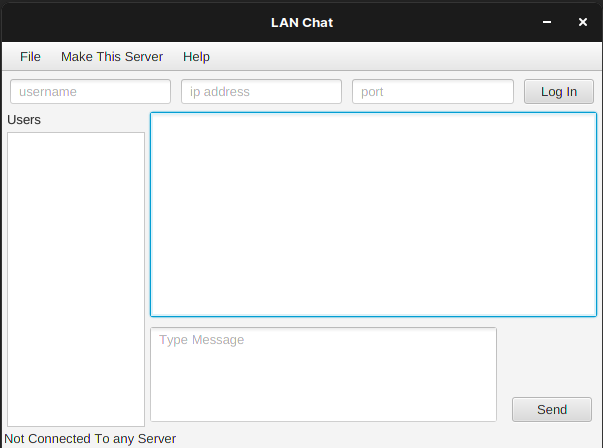
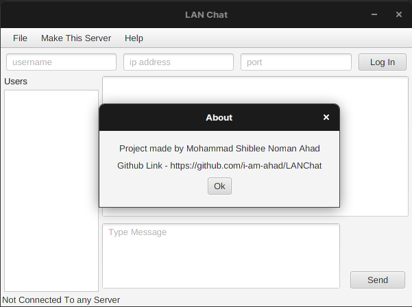
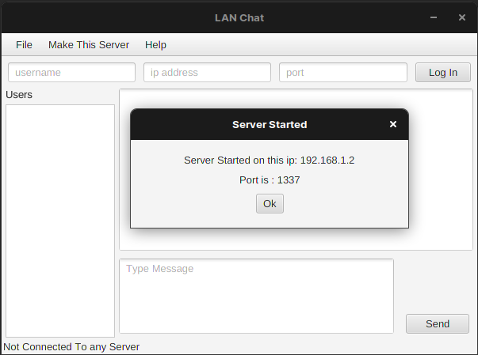
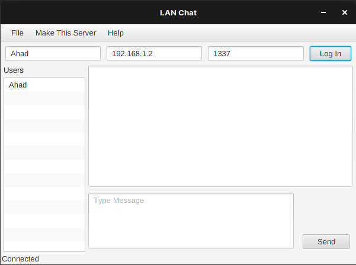
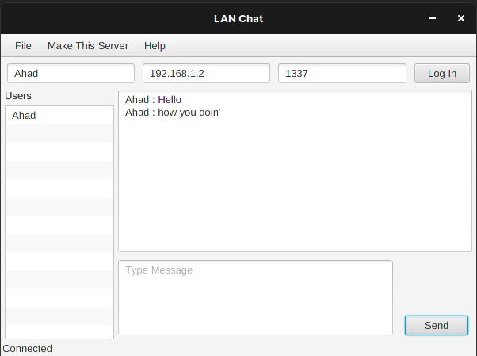

# LANChat

LANChat is a GUI based application to communicate between clients within the same network.

### Tech

LANChat uses a number of tech to work properly:

* [JDK] - not less than v11
* [JavaFX] - JavaFX v14

And of course LANChat is open source with a public repository on GitHub.

### Installation

LANChat requires :
- [JDK](http://jdk.java.net/14/) v14 to run (not less than v11).
- [JavaFX](https://openjfx.io/) v14

Install the SDK and Libries to run the application.

#### NOTE: Recommended IDE is IntelliJ IDEA 

### Screenshots
----

### Development

Want to contribute? Great! :heart:

Fork the repo make changes and make pull requests.

### Todos

 - Transfer Files between clients.
 - Make a better GUI
 - Release Executables for Windows, MAC & Linux

License
----

Apache License 2.0

**Free Software, Hell Yeah!**
